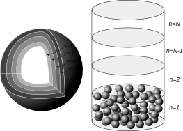

# Summary
`OpenTerrace` is a simulation framework to predict the transient temperature response of thermal energy storage systems. The thermal energy storage system contains a carrier fluid and an optional bed phase. Heat is transferred from the fluid to the bed material during charging and from the bed phase to the fluid during discharging. `OpenTerrace` uses a finite volume formulation to discretise a set of coupled partial differential equations governing heat transfer in the fluid and bed phase. `OpenTerrace` comes with a wide range of predefined substances to be used as either fluid or bed material. Also, the set of primitive, predefined shapes that comes with `OpenTerrace` cover many applications. `OpenTerrace` is build to be:
- Fast by making use of modern compilers and optimised tri-diagonal matrix solvers, OpenTerrace is built to be fast.
- Flexible for easy integration in system models or optimisation loops.
- Extendable by allowing new modules for new materials such as non-spherical rocks or exotic Phase Change Materials (PCM) to easily be plugged into the OpenTerrace framework.

More information about how to get started along with a user guide can be found in the [OpenTerrace documentation](https://openterrace.github.io/openterrace-python/). [Contribute](https://openterrace.github.io/openterrace-python/contributing/) to the [GitHub repository](https://github.com/OpenTerrace/openterrace-python) with new functionality by sending pull requests.

# Statement of need
Being able to store energy for extended periods of time is important for modern societies where increasing amounts of energy comes from renewable sources with time-varying production. Many storage technologies exist, each with their own set of disadvantages and advantages. Storing energy in the form of thermal energy is a promising solution because it is cheap and can easily be scaled up.

Research on thermal energy storage systems commonly relies on in-house developed code, which makes the results presented in research papers less transparent and not reproducible.
`OpenTerrace` is an open-source simulation framework, which aims to provide researchers and decision makers in industry with a common, open-source framework for simulating thermal energy storage packed bed systems.

The core part of the computations relies on calls to low-level languages using packages such as NumPy [@harris], SciPy [@virtanen] and  Numba [@lam] for speed while maintaining the flexibility and user-friendliness of Python. Plotting and animation capabilities based on Matplotlib [@hunter] are provided with the framework to allow easy access to visualisations.

`OpenTerrace` solves for a fluid phase, which is descretised in `N` nodes. Within each fluid volume element, the bed material is assumed to have the same temperature distribution. The bed material is discretised in `M` nodes resulting in `N x M` equations to be solved for each time step.

Each phase is described by a non-linear, partial differential equation. The phases are coupled using source terms to account for various physical mechanisms such as heat loss and convective heat transfer between the phases. The framework is flexible in such a way that new types of source terms, new domain shape functions, new fluid and bed substances (including phase-changing substances) with both temperature dependent- and independent properties and new numerical discretisation schemes can easily be added. A set of tutorials is also provided with the framework to highlight its functionality in its current version and to ease the learning curve for new users. Also various unit tests are provided to verify different parts of the code in some well-defined benchmark cases.

*Right side figure shows a cylindrical storage tank with 4 discretisations. The bed material in each volume element is assumed to have similar temperature distribution. Left side figure shows discretisation of the bed material, which in this case is assumed to be a hollow sphere.*

# Features and functionality

# Target Audience

`OpenTerrace` serves different purposes. First and foremost it is a research tool to be used by researchers and industry for design decisions. Also, it has now proven in an educational context where engineering students become familiar with thermal storage systems, test out new ideas, or extend the functionality of OpenTerrace to include new  and improve their where the learning outcome includes both thermal energy storage knowledge and coding experience with Python.

# Acknowledgements

This research has received funding from EU Horizon project SERENE under grant agreement no. 130930.

# References
